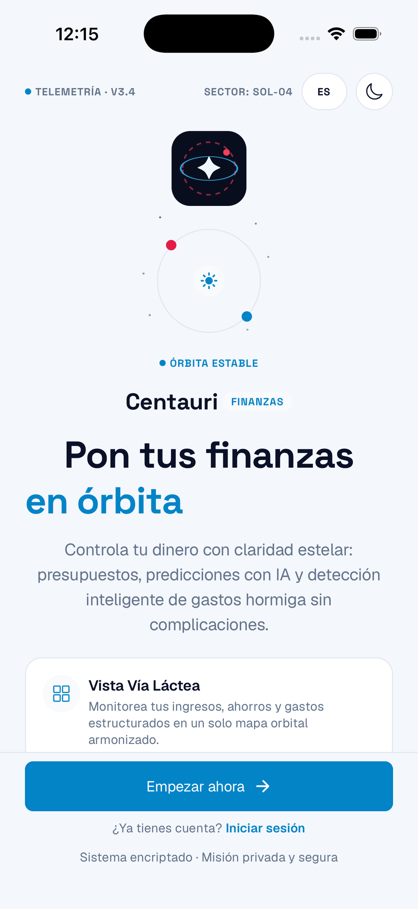
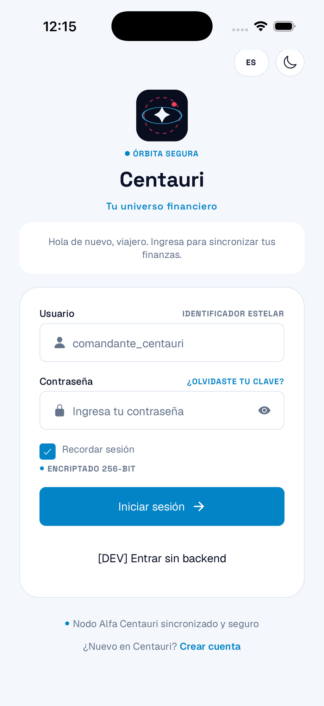

# Centauri

**A personal expense tracker with AI-generated spending insights.**
Built as a portfolio project (React Native / Expo) to showcase a real,
end-to-end mobile app — not just static screens, but working auth, a live
backend, and an AI feature that's actually load-bearing.


## Demo


## Contents

- [Overview](#overview)
- [Key features](#key-features)
- [Screens](#screens)
- [Tech stack](#tech-stack)
- [Getting started](#getting-started)
- [Project structure](#project-structure)

## Overview

Centauri tracks income and expenses, groups them into a "planetary spending
system" visualization, and periodically asks an LLM to read your recent
transactions and generate plain-language insights, recommendations, and
warnings — the kind of judgment call a spreadsheet can't make on its own.
It also handles spending-goal cycles, multi-language and multi-currency
support, and light/dark theming, all persisted across restarts.

The frontend is this repo; it talks to a separate Node/Express/PostgreSQL
backend (`centauri-ai-backend`) over a documented REST API — this app never
reimplements backend logic, it only consumes it.

## Key features

- **AI-generated insights** (`GET /ai/insights`, backend-cached 6h) surfaced
  as a narrative hero card instead of raw stat tiles — the differentiator
  over a plain budgeting app.
- **Spending-goal / budget cycles**: set an amount + days, get prompted
  again next login if dismissed, notified when a cycle ends.
- **Local "new insight" detection**: a notification badge tracks unseen AI
  insights via a content fingerprint, since the endpoint has no unread flag.
- **Month-over-month expense trend**, computed entirely client-side from
  already-fetched transactions.
- **Multi-language** (English / Spanish) via i18next, including the AI
  insight text itself (`?lang=` on the insights endpoint).
- **USD / COP currency toggle**, dark/light theme — both persisted across
  restarts via `expo-secure-store`.
- **Native share sheet** for AI insights.
- **JWT auth** with refresh-token rotation and silent background renewal.
- **Profile screen** with logout.

## Screens

<table>
  <tr>
    <td align="center"><b>Welcome</b></td>
    <td align="center"><b>Login</b></td>
  </tr>
  <tr>
    <td></td>
    <td></td>
  </tr>
  <tr>
    <td align="center"><b>Sign Up</b></td>
    <td align="center"><b>Dashboard</b></td>
  </tr>
  <tr>
    <td></td>
    <td></td>
  </tr>
  <tr>
    <td align="center"><b>Transactions (Orbits)</b></td>
    <td align="center"><b>AI Coach</b></td>
  </tr>
  <tr>
    <td></td>
    <td></td>
  </tr>
</table>

Every screen also fully supports light mode, toggled live and persisted
across restarts:

<table>
  <tr>
    <td align="center"><b>Welcome (light)</b></td>
    <td align="center"><b>Login (light)</b></td>
  </tr>
  <tr>
    <td></td>
    <td></td>
  </tr>
</table>

**Dashboard** — balance overview, planetary spending visualization, budget
cycle progress, month-over-month expense trend, and the AI proactive-alert
card (tappable, jumps into AI Coach).

**AI Coach** — hero card surfaces the single highest-priority item (warnings
before recommendations before plain insights), with a context line ("Based
on your last N transactions"), a share button, and a CTA that adapts — it
opens the budget prompt when the top insight is a warning and there's no
active budget, otherwise it jumps to Transactions. Everything else is a
labeled grid below, no scrolling required.

## Tech stack

**Frontend** (this repo)
- React Native (Expo, New Architecture) + React Navigation (native-stack /
  bottom-tabs)
- Context API for global state (auth, theme, currency, budget)
- i18next / react-i18next for English + Spanish
- `expo-secure-store` for all local persistence (session, theme, currency,
  language, budget/insight notification state)

**Backend** (`centauri-ai-backend`, separate repo)
- Node.js / Express
- PostgreSQL (hosted on Neon)
- JWT auth with refresh-token rotation
- Groq for AI insight generation

## Getting started

Requires Node.js, the Expo CLI, and Xcode (for iOS) or Android Studio (for
Android). This app uses native modules (`expo-secure-store`, fonts), so it
needs a custom dev client — plain Expo Go won't work.

```bash
# Install dependencies
npm install

# Point the app at your backend (defaults to production outside dev)
echo "EXPO_PUBLIC_API_URL=https://centauri-ai-backend.onrender.com" > .env

# Build and run the dev client (first run only, or after adding a native dep)
npm run ios      # or: npm run android

# Subsequent runs
npm start
```

## Project structure

```
api/            REST client per resource (auth, transactions, ai, budget)
                + httpClient.js (centralized fetch with dev logging)
components/     Reusable UI (Button, AppTextInput, toggles, modals)
context/        Global state: Auth, Theme, Currency, Budget
i18n/           i18next setup + en/es translation files
navigation/     React Navigation stacks (Auth, App tabs + Profile modal)
screens/        One screen per route
theme/          Design tokens (colors, spacing, typography)
utils/          Category mapping, insight parsing, trends, etc.
```
