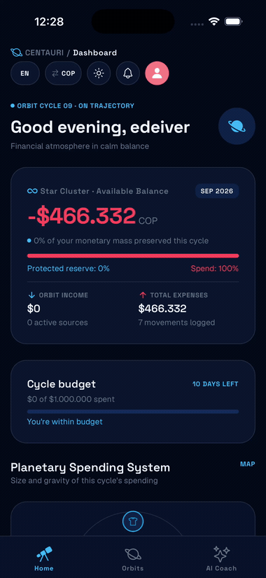
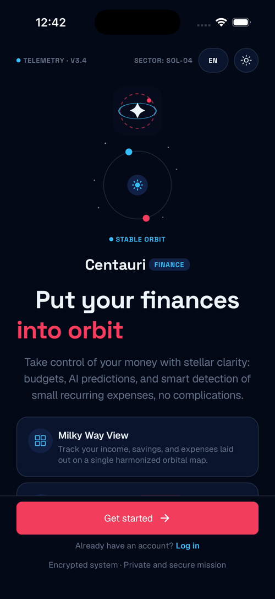
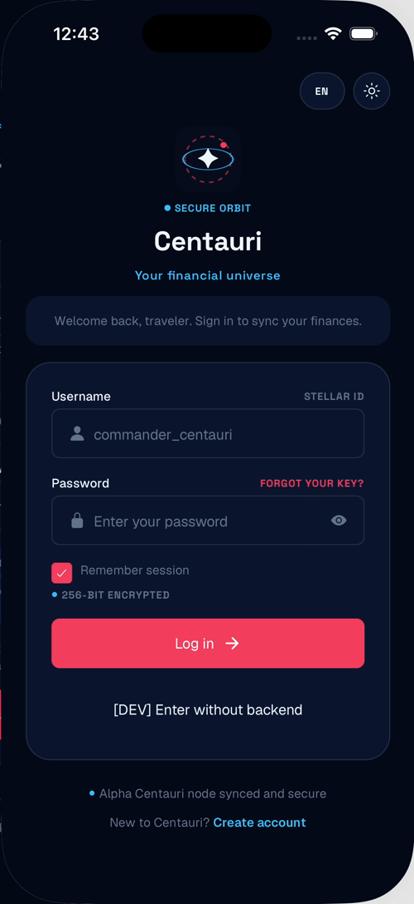
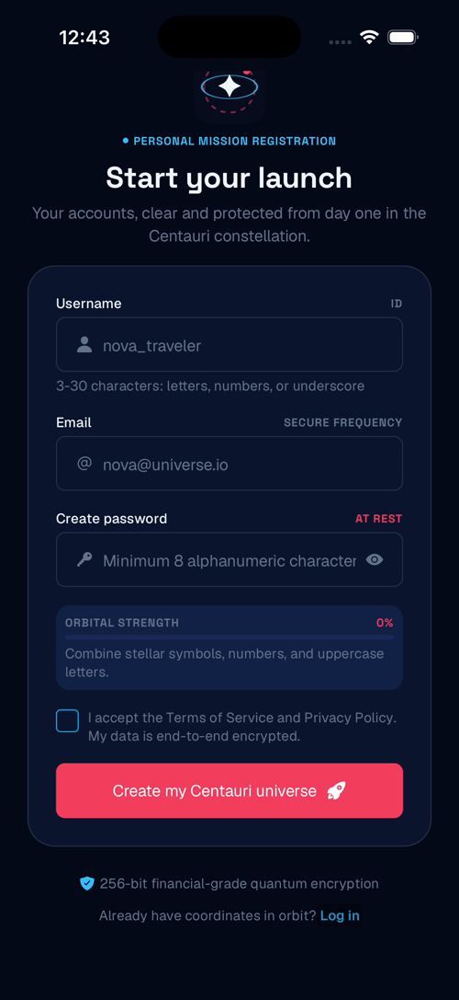
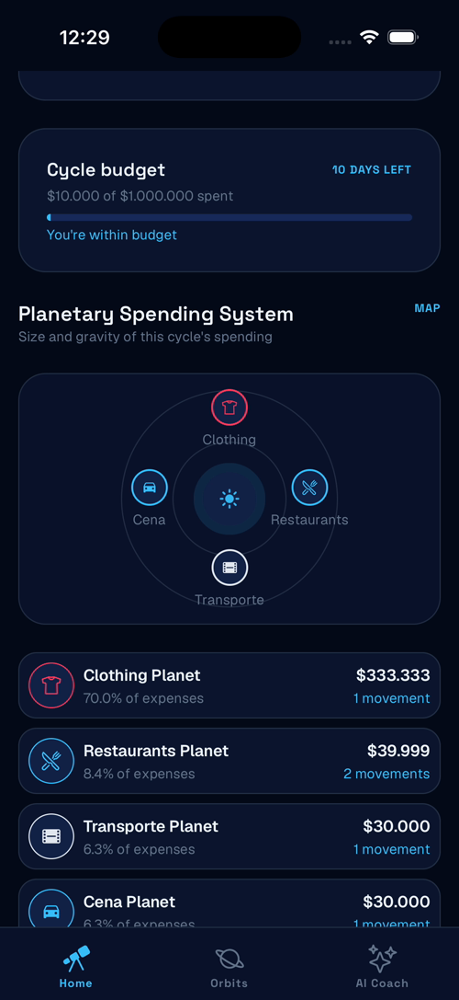
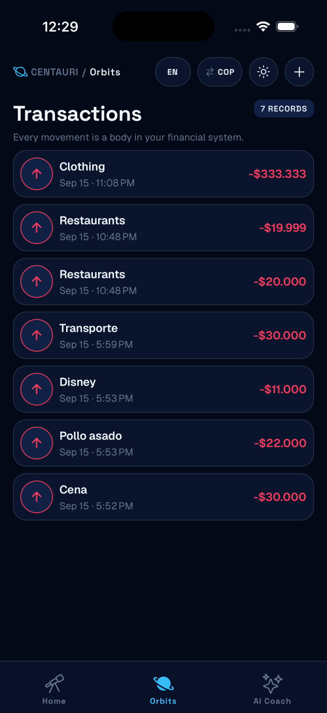
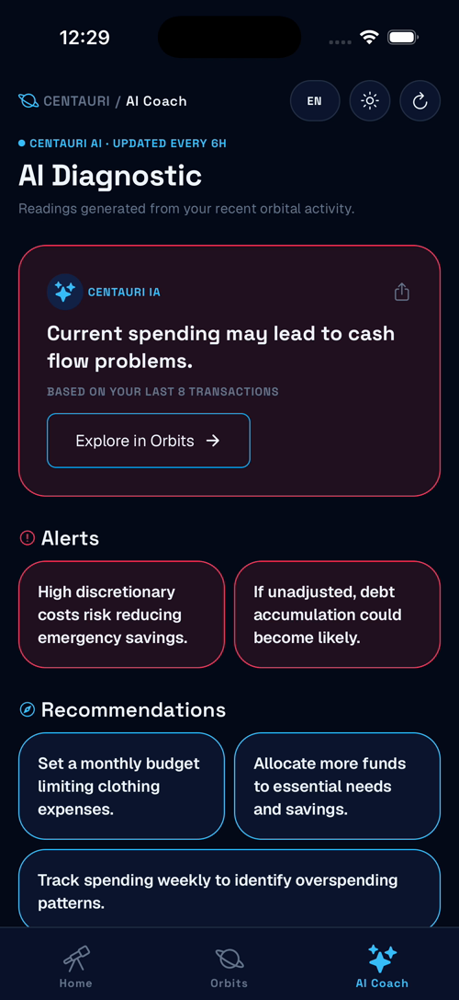

# Centauri

A personal expense tracker (React Native / Expo) with AI-generated spending
insights, built as a portfolio project.

## Demo

<!--
Suggested recording flow (captures the full engagement loop, not just static
screens): log in -> scroll the Dashboard (balance, planetary spending system,
budget progress card) -> tap the "Centauri AI Proactive Alert" card -> land on
AI Coach's hero card -> tap the hero CTA (opens the budget prompt when the top
insight is a warning and there's no active budget) -> tap the share icon on the
hero card -> toggle language (ES/EN) and watch AI Coach refetch in the new
language -> toggle currency (USD/COP) and theme (dark/light).
-->



## Screens

### Welcome


### Login / Sign Up



### Dashboard
Balance overview, planetary spending visualization, budget cycle progress,
month-over-month expense trend, and the AI proactive-alert card (tappable,
jumps into AI Coach).



### Transactions (Orbits)


### AI Coach
Hero card surfaces the single highest-priority item (warnings before
recommendations before plain insights), with a context line ("Based on your
last N transactions"), a share button, and a CTA that adapts — it opens the
budget prompt when the top insight is a warning and there's no active budget,
otherwise it jumps to Transactions. Everything else is a labeled grid below,
no scrolling required.



## Key features

- **AI-generated insights** (`GET /ai/insights`, backend-cached 6h) surfaced as
  a narrative hero card instead of raw stat tiles — the differentiator over a
  plain budgeting app.
- **Spending-goal / budget cycles**: set an amount + days, get prompted again
  next login if dismissed, notified when a cycle ends.
- **Local "new insight" detection**: a notification badge tracks unseen AI
  insights via a content fingerprint, since the endpoint has no unread flag.
- **Month-over-month expense trend**, computed entirely client-side from
  already-fetched transactions.
- **Multi-language** (English / Spanish) via i18next, including the AI
  insight text itself (`?lang=` on the insights endpoint).
- **USD / COP currency toggle**, dark/light theme — both persisted across
  restarts via `expo-secure-store`.
- **Native share sheet** for AI insights.
- **Profile screen** with logout.

## Tech stack

- **Frontend**: React Native (Expo, New Architecture), React Navigation,
  Context API for global state, i18next.
- **Backend**: Node.js / Express, PostgreSQL (Neon), JWT auth with refresh
  rotation, Groq for AI insight generation. Repo: `centauri-ai-backend`.

## Adding the media

```
docs/demo.gif                     ✅
docs/screenshots/welcome.png      ✅
docs/screenshots/login.png        ✅
docs/screenshots/signup.png       ✅
docs/screenshots/dashboard.png    ✅
docs/screenshots/transactions.png ✅
docs/screenshots/ai-coach.png     ✅
```
